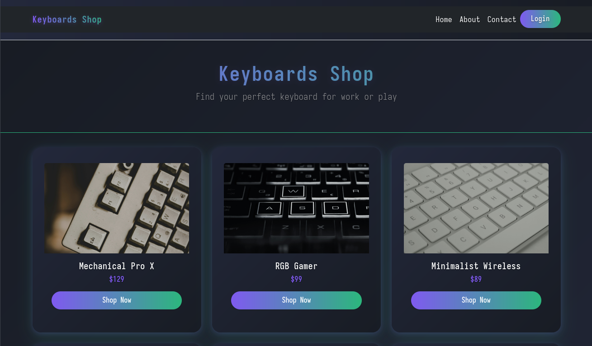
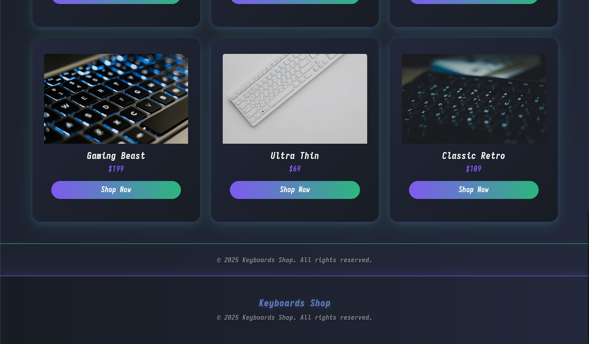
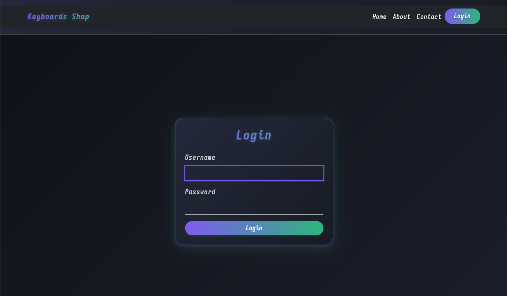
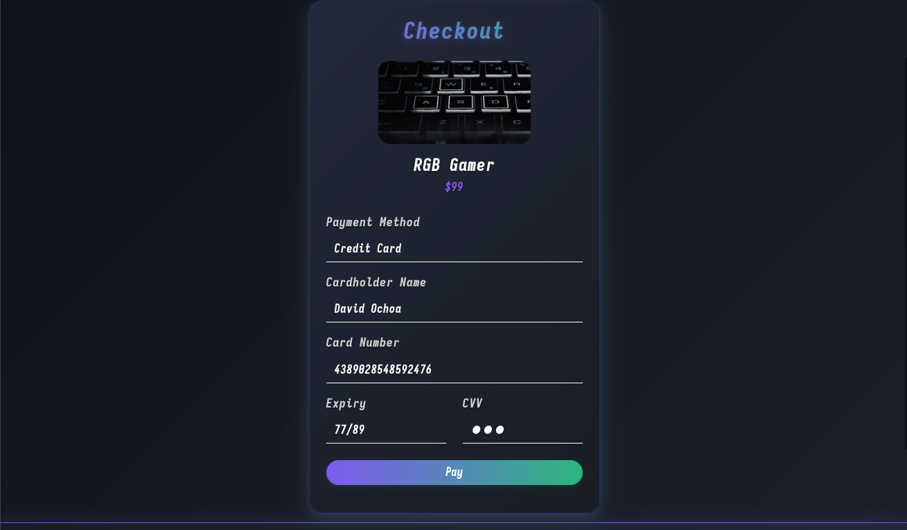
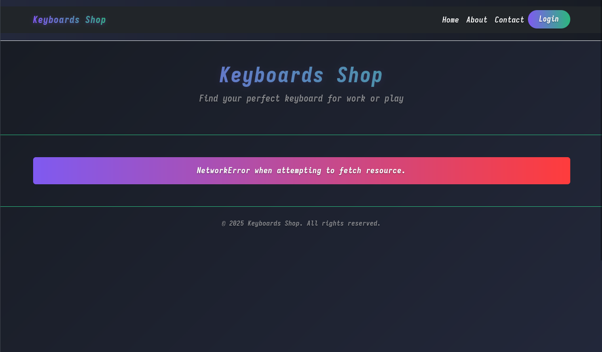

# Keyboard-Web-Project
Full-Stack web project developed with React, Bootstrap and ExpressJS
#


# Execution Instructions
Install server dependencies:
```
npm install express body-parser cors jsonwebtoken express-jwt
```
Execute server in /src:
```
node server.js
```
# Preview Screenshots





